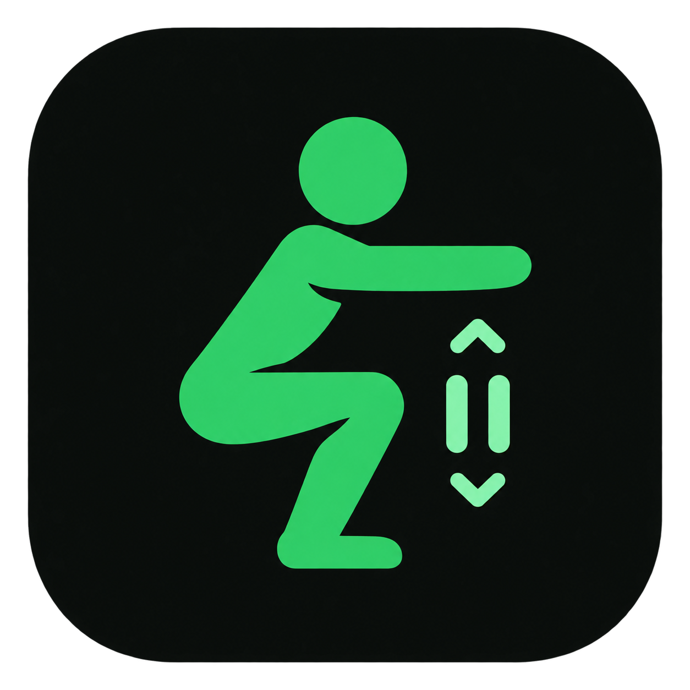

<div align="center" >



# Squat Counter App


A Flutter mobile app that uses the phone's accelerometer to automatically<br>
detect and count squats, tracking repetitions and sets in real time.


</div>

## Features

- Automatic squat detection via accelerometer, no manual input required
- Configurable number of repetitions per set and total sets
- Live workout progress tracking

## Tech Stack

- [Flutter](https://flutter.dev) / Dart
- [sensors_plus](https://pub.dev/packages/sensors_plus) for accelerometer data
- Android SDK

## Getting Started

### Prerequisites

- [Flutter SDK](https://docs.flutter.dev/get-started/install) (Dart ^3.11.5)
- Android device or emulator

### Run locally

```bash
flutter pub get
flutter run
```

## Project Structure

```text
lib/
 ├── core/
 │   ├── services/sensor_service.dart
 │   └── theme/app_theme.dart
 │
 ├── features/workout/
 │   ├── controllers/workout_controller.dart
 │   ├── models/workout_config.dart
 │   ├── screens/
 │   │   ├── workout_setup_screen.dart
 │   │   └── workout_session_screen.dart
 │   └── widgets/
 │       ├── number_selector.dart
 │       └── progress_card.dart
 │
 └── main.dart
```

## How It Works

1. The user sets up the workout (reps per set and total sets).
2. The app starts reading the accelerometer.
3. Squat movements are detected from the sensor data.
4. Repetitions and sets are counted and displayed automatically.
5. The workout ends once the configured goal is reached.

## License

Distributed under the [MIT License](LICENSE).
